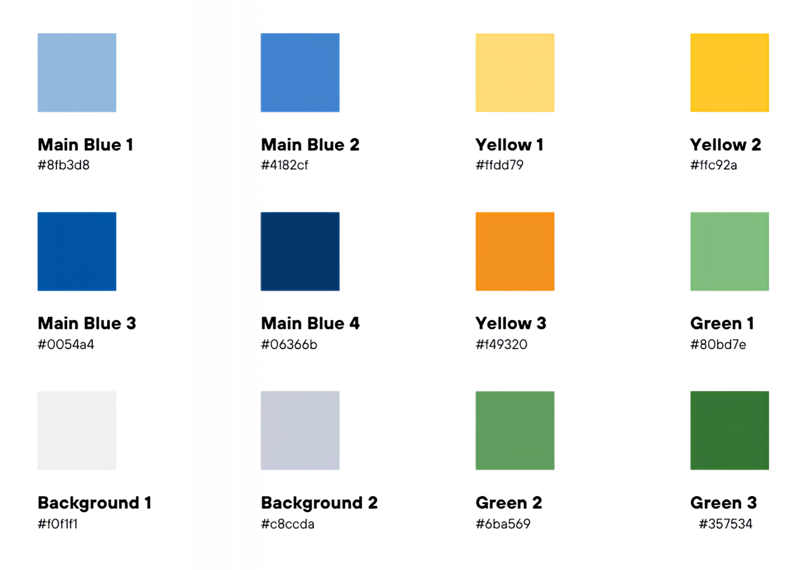
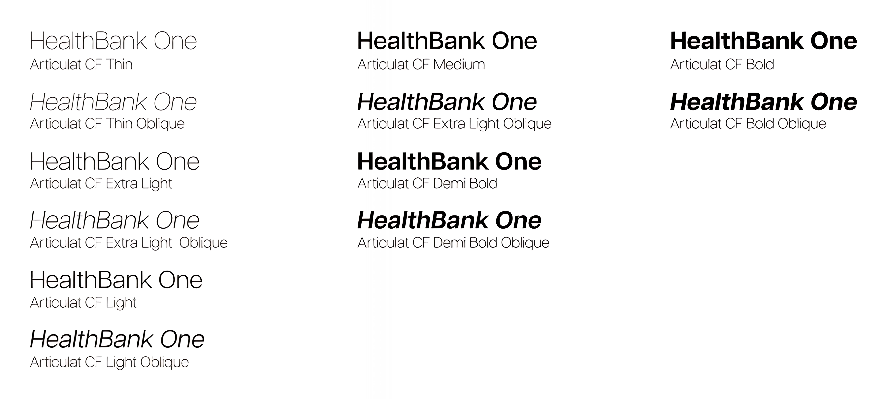
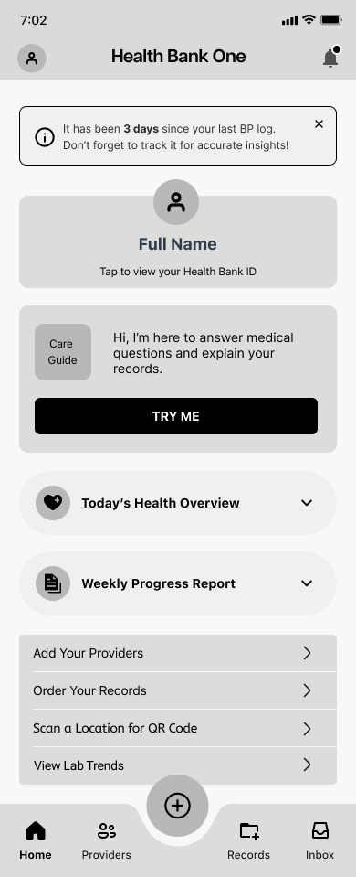
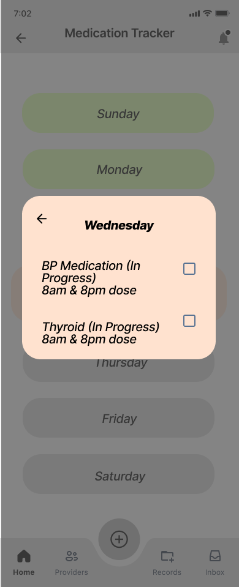
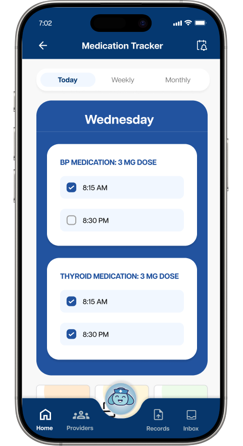
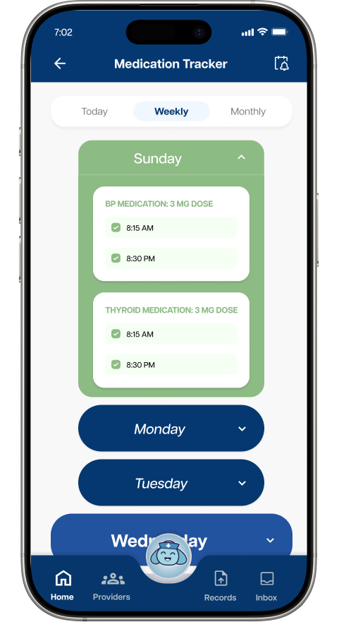
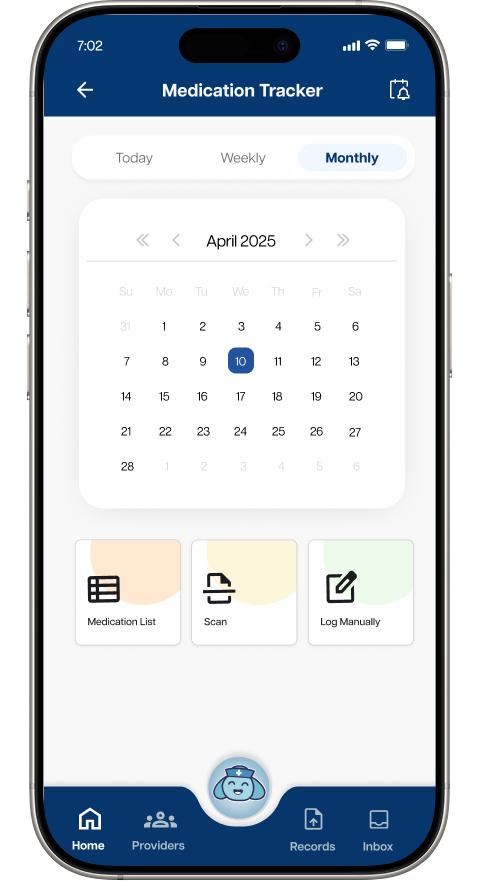

<h1>Health Bank One Case Study</h1> 

 

<h2>🤝 Your Partner in Health</h2>

  
  
Care Guide - Designed By Nidhi Lalwani

 

  
  
  
  

 
 

<h2>📋 Project Details</h2>

<ul> 
  <li><strong>Client - </strong>Health Bank One</li>
  <li><strong>Role - </strong>Researcher</li>
  <li><strong>Scope - </strong>3 months</li>
  <li><strong>Tools - </strong>Figma, Excel</li>
</ul>

<h2>👥 Team</h2>
<ul>
  <li><strong>Reina Park - </strong>Project Manager</li>
  <li><strong>Steve Arimokwu - </strong>Designer</li>
  <li><strong>Nidhi Lalwani - </strong>Designer</li>
  <li><strong>Anjali Singh - </strong>Developer</li>
  <li><strong>Philip Nguyen - </strong>Researcher</li>
  <li><strong>Jasha Dela Cruz - </strong>Survey Researcher</li>
</ul>

 

 

  <h2>🎯 Design Challenge</h2>
  
Health Bank One invited our Applied Experience Design class at UTD during the Spring 2025 semester to design concepts that boost user engagement and retention in its app. This challenge seeks features and designs that drive user value, repeat use, and long-term engagement. The target demographic is women aged 40-65 who manage chronic conditions for themselves or their family members, and proactive, health-conscious women. Our class consisted of multiple teams, so half would focus on chronic conditions and the other half on health and wellness. My team decided to focus on chronic conditions. The project aims to understand user motivations and needs by conducting design research methods, designing mobile app wireframes of proposed features, and developing a high-fidelity prototype showcasing the solutions. 
  
  <h2>❓ The Problem</h2>
  
  

  When middle-aged women with chronic health conditions need to manage their medical records and track their health, they want a user-friendly, accessible app that integrates with wearables, tracks lab trends, and securely stores all health records so they can conveniently monitor their health, access records in one place, and make informed decisions about their care.
  

  
  <h2>💡 The Solution</h2>
  
  

  To solve the problem, my team decided to expand on the existing features of the Health Bank One app and add key features: Health Dashboard, Daily Health Log, Lab Reports, Trend Analysis, and Medication Tracker. The goal is to increase the functionality and practicality by giving users more reasons to use the app. Health Bank One would go from an app primarily for medical record consolidation to an all-purpose health app. 
  

 

  <h2>📊 Survey Takeaways</h2>
  
  
In the first sprint, our survey researchers from each team collaborated to create a survey, while the rest of the class focused on developing a distribution strategy. My team planned to distribute the survey to friends, family, organizations, and relevant subreddits. After receiving over 90 responses in approximately two weeks, we closed the survey. The survey team exported the results to Google Forms and shared them with the class. I chose to analyze the data using Microsoft Excel. Although there were more than 90 responses, many respondents were male or under the age of 35. As a result, I needed to filter out the irrelevant data, leaving me with around 30 valid responses. I employed pivot tables and Power Query to organize the data and visualized the results using bar and pie charts. 

  

   
  
  
  

 
  
 
     
    <ul>
      <li>60% of women with chronic conditions monitor their health daily, and 64% use phone apps or smartwatches — highlighting strong interest in digital health tools</li>
      <li>19% report technical difficulties when managing health records — the most frequent barrier identified</li>
    </ul>
     
  

 
  
  

  
 
     
    <ul>
      <li>56% find accessing their medical records difficult or confusing</li>
      <li>69% rate a health progress tracking feature as very valuable (4–5 stars)</li>
    </ul>
     
  

  
  
  

  
 
     
    <ul>
      <li>85% rate an appointment & medication prescription feature as very valuable (4–5 stars)</li>
      <li>69% rate the ability to create personal profiles for storing critical medical information as very valuable (4–5 stars)</li>
    </ul>
  

  

  <h2>📚 Secondary Research</h2>
  
  

  For the second sprint, our project manager and I worked together and found 12 articles for our secondary research. We decided that the survey researcher, the project manager, and I would each analyze and summarize 4 research articles. Meanwhile, the rest of our team will conduct competitive analysis by locating and analyzing 3 apps with similar features and functionality to Health Bank One.
  

  
  <h3>Research Articles Key Points</h3>
  
  <ul>
    <li>Valued features include easy navigation, peer support, accessible info, secure data, and practical tools.</li>
    <li>Users found digital health tools eased condition management and boosted self-awareness, proactivity, and self-care confidence.</li>
    <li>Engaging health apps provide personalized tracking, goals, reminders, and secure provider communication.</li>
    <li>Symptom tracking, reminders, and gamification can boost long-term engagement.</li>
    <li>AI-driven insights and seamless EHR integration can enhance health tracking.</li>
  </ul>
  
  

    
    
    
  

  
  <h3>Competitive Analysis</h3>
  
  <h4>One Record</h4>
  
  <ul>
    <li>Let users access, combine, and share their healthcare data across providers, payers, and pharmacies, creating a unified health history.</li>
    <li>Patients fully control their medical records, securely sharing them with trusted individuals and organizations.</li>
  </ul>
  
  <h4>Medisafe</h4>
  
  <ul>
    <li>Medication adherence via push notifications, premium features to boost user retention, and gamified health tracking to encourage overall wellness.</li>
    <li>Provides drug interaction warning, caregiver reminders, and family scheduling and tracking.</li>
  </ul>
  
  <h4>Healow</h4>
  
  <ul>
    <li>Offers medication reminders, activity tracking, and weight management to help users set and monitor health goals.</li>
    <li>Integration with Apple Health, Fitbit, and other wearables for real-time health data syncing.</li>
    <li>Simplifies appointment scheduling, telehealth, and prescription management in one platform.</li>
  </ul>
  
  

    
    
    
  

  <h2>🔍 Primary Research</h2>
  
  

  In the third sprint, my team conducted 6 interviews with women who matched the target audience. I worked on the interview guide with our project manager and developer. The questions consisted of interactions with healthcare providers, finding information, storing medical records, and using technology. Additionally, I conducted one in-person interview with a woman who has the chronic condition of sciatica. Our designers also worked on a design persona based on the research. 
  

  
  <h3>Interviews Insights</h3>
  
  <ul>
    <li>Some participants express difficulty using technology and health portals.</li>
    <li>4 of the participants have wearables or plans to get one.</li>
    <li>There are security and privacy concerns with a digital platform.</li>
    <li>Participants prefer in-person communication with doctors.</li>
    <li>Participants prefer text message reminders.</li>
    <li>Some participants found medical terminology confusing and difficult to understand.</li>
    <li>Participants rely on their doctors for medical advice more than on online sources.</li>
  </ul>
  
  <h3>Design Persona</h3>
  
  

  <h2>🎨 Branding</h2>
  
  

  In the fourth sprint, our group worked on branding, low-fidelity wireframing, and planning out our features for the app. The main features we chose are a health dashboard, medication tracker, and trend analysis. Our designers and the developer worked on the low-fidelity wireframes. Meanwhile, our project manager and both researchers worked on the branding side, which includes colors, typography, and icons. 
  

  <h3>Color Palette</h3>

  
For the colors, we decided to keep a similar palette to the original Health Bank One colors to keep things consistent. The primary colors are shades of blue because blue is Health Bank One's color. Secondary colors include shades of yellow and green. Our goal with these colors is to keep a similar look and feel to the original.
  

  

    
  

  <h3>Typography</h3>

  
We chose the Adobe font, Articulat CF, as the font in the app. To keep things consistent, the typography will be the same for every text throughout. Articulat CF has many variants or styles, so it will be very useful for different situations. 

  

  <h3>Iconography</h3>

  
I picked the Google Material Symbols as the icons for the app. Since we are using Figma for the designs, the plugin for Material Symbols was very convenient. We could easily search for icons and adjust attributes like fill, weight, grade, and optical size before placing them in the Figma file. 

  

  <h2>✏️ Low-Fidelity Wireframing</h2>

  
The plan was the have our designers and the developer work on the low-fidelity wireframes to design the general layouts of the features. After the low-fidelity wireframes were done, the rest of the team would help design,  suggest improvements, and expand the designs based on the existing wireframes. The low-fidelity wireframes would include the home screen, medication tracker, health dashboard, and trend analysis. Once again, these wireframes below were designed by Steve (Designer), Nidhi (Designer), and Anjali (Developer). 
  

  

    
    
    
    
    
  

<h3>User Flow</h3>

Additionally, Jasha (Survey Researcher) and I worked on the user flow in order to visualize how the users would progress through the app.

 

  <h2>📱 High-Fidelity Wireframing</h2>
  
  

    After receiving feedback from our milestone check-in, our team shifted to working on the high-fidelity wireframes with the feedback in mind. Our team decided to split into 3 mini-teams consisting of pairs. A pair would work together and focus on a different feature. Reina (Project Manager) and Anjali (Developer) worked on the onboarding screens. Nidhi (Designer) and Jasha (Survey Researcher) worked on the Lab Reports, Trend Analysis, and profiles. I (Researcher) and Steve (Designer) worked on the Medication Tracker. Nidhi, Jasha, Anjali, Reina, and I worked on the settings. Anjali also worked on the Daily Health Log and Health Dashboard.
  

  
<em>Note: These wireframes do not show everything. To get a full view of any screen, please refer to the prototype at the end.</em>

  <h3>Care Guide</h3>

  

    Our team felt that the original care guide button (above the navigation bar) in the Health Bank One app was confusing because it looked like a plus sign. We thought that users would assume it's a button to add something and not the care guide. Furthermore, the current app logo for Heath Bank One consists of a plus sign with the word "Bank" below it. It can be easily mistaken for a bank app instead of a health app. Therefore, Nidhi designed a new look for the care guide to make it more clear. She also designed a new app logo, but still included the same plus sign from the original. 
  

  

    
    
  

  <h3>Medication Tracker</h3>

  

    This feature allows the user to add their medications and track them daily. Users can switch to a daily, weekly, or monthly view. On the current day, users can indicate whether they took a medication or not by checking a box. For the weekly view, users can select a previous day to check if they took a medication or not. The monthly view allows users to view any past days, weeks, months, and years. In order to add medication, users can either manually input or scan a medication by pressing the respective button at the bottom. Users could view the medication list to make changes or delete any current medications. 
  

  

    The final design looks very different from the low-fidelity wireframe because I suggested many improvements. I noticed that the initial design only had a weekly view. So I thought it would be better to include multiple views in case the user wanted to check their medication usage in the past. There was also initially no method to add medication or view current medication. Therefore, I proposed a medication list and a way to manually add medication. Steve also came up with the idea to scan a medication if users don't want to do it manually. I changed the general design from a pop-up to a drop-down in order to make it similar to other features in the app. Lastly, Anjali changed some colors and icons to make it consistent with other screens. 
  

  

    
    
    
    
    
    
  

  

  <h2>🚀 Prototype</h2>
  
  
We worked on the prototype after completing the high-fidelity wireframes. I worked on the prototype for the Medication Tracker and the Medication Reminders in the settings. 

  
  👉 <a href="https://www.figma.com/proto/MgBaPCBHcjpSGGoBOg1Cfy?content-scaling=fixed&kind=proto&node-id=587-2978&page-id=46:74&scaling=scale-down&starting-point-node-id=587:2978">Prototype on Figma</a>

