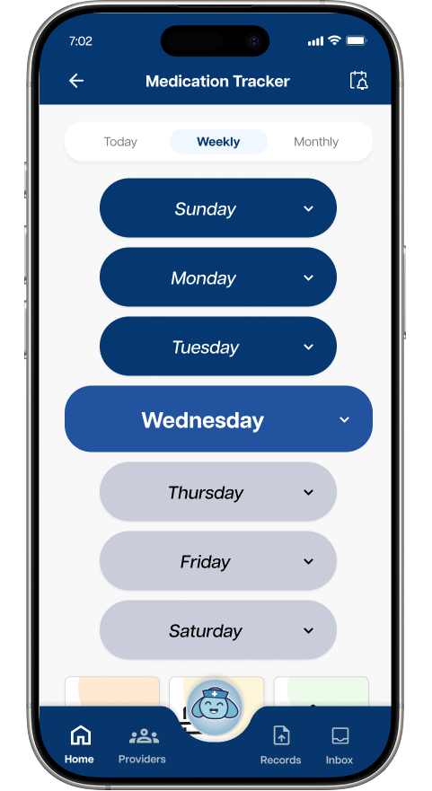
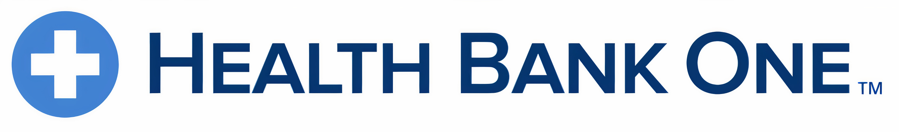
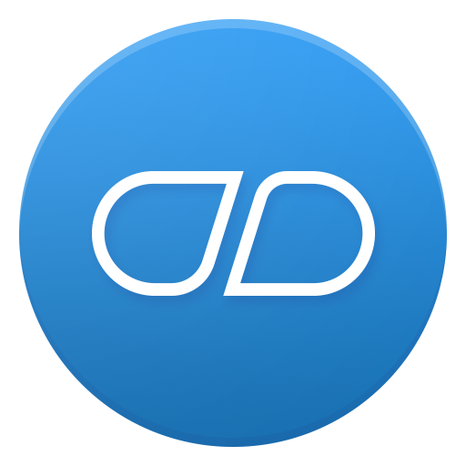

<h1>Health Bank One   <em>Case Study - 2025</em></h1>

 

<h2>Your Partner in Health</h2>

  
  
Care Guide - Designed By Nidhi Lalwani

 

  
  
  
  

 
 

<h2>Project Details</h2>

<ul> 
  <li><strong>Client - </strong>Health Bank One</li>
  <li><strong>Role - </strong>Researcher</li>
  <li><strong>Scope - </strong>3 months</li>
  <li><strong>Tools - </strong>Figma</li>
</ul>

<h2>Team</h2>
<ul>
  <li><strong>Reina Park - </strong>Project Manager</li>
  <li><strong>Steve Arimokwu - </strong>Designer</li>
  <li><strong>Nidhi Lalwani - </strong>Designer</li>
  <li><strong>Anjali Singh - </strong>Developer</li>
  <li><strong>Philip Nguyen - </strong>Researcher</li>
  <li><strong>Jasha Dela Cruz - </strong>Survey Researcher</li>
</ul>

 

 

<h2>Desgin Challenge</h2>

Health Bank One invited our Applied Experience Design class at UTD during the Spring 2025 semester to design concepts that boost user engagement and retention in its app. This challenge seeks features and designs that drive user value, repeat use, and long-term engagement. The target demographic is women aged 40-65 who either manage chronic conditions for themselves or their family members, and proactive, health-conscious women. Our class consisted of multiple teams, so half of the teams would focus on chronic conditions and the other half would focus on health and wellness. My team decided to focus on chronic conditions. The goal of the project is to understand user motivations and needs by conducting design research methods, design mobile app wireframes of proposed features, and developing a high-fidelity prototype showcasing the solutions. 

<h2>The Problem</h2>

When middle-aged women with chronic health conditions need to manage their medical records and track their health, they want a user-friendly, accessible app that integrates with wearables, tracks lab trends, and securely stores all health records so they can conveniently monitor their health, access records in one place, and make informed decisions about their care.

<h2>The Solution</h2>

To solve the problem, my team decided to expand on the existing features of the Health Bank One app and add key features: Health Dashboard, Daily Health Log, Lab Reports, Trend Analysis, and Medication Tracker. The goal is to increase the functionality and practicality by giving users more reasons to use the app. Health Bank One would go from an app primarily for medical record consolidation to an all-purpose health app. 

 

<h2>Survey Results</h2>

In the first sprint, our survey researchers from each team worked together to build a survey. Meanwhile, the rest of the class worked on the distribution strategy. My team planned to send the survey to friends, family, organizations, and relevant subreddits.

<h3>Takeaways</h3>

<ul>
  <li>36% of women with chronic conditions face technical difficulties managing their records.</li>
  <li>58% of women with chronic conditions track their health daily, showing strong interest in digital health tools.</li>
  <li>While 68% are satisfied with explanations from lab results, 29% only sometimes understand the results.</li>
  <li>54% of participants rated a feature that can log health progress and conditions as most valuable</li>
  <li>Participants want all records in one place, family access options, lab results trends, and integration with smartwatches and health devices.</li>
</ul>

<h2>Secondary Research</h2>

For the second sprint, our project manager and I worked together and found 12 articles for our secondary research. We decided that the survey researcher, the project manager, and I would each analyze and summarize 4 research articles. Meanwhile, the rest of our team will conduct competitive analysis by locating and analyzing 3 apps with similar features and functionality to Health Bank One.

<h3>Research Articles Key Points</h3>

<ul>
  <li>Valued features include easy navigation, peer support, accessible info, secure data, and practical tools.</li>
  <li>Users found digital health tools eased condition management and boosted self-awareness, proactivity, and self-care confidence.</li>
  <li>Engaging health apps provide personalized tracking, goals, reminders, and secure provider communication.</li>
  <li>Symptom tracking, reminders, and gamification can boost long-term engagement.</li>
  <li>AI-driven insights and seamless EHR integration can enhance health tracking.</li>
</ul>

  
  
  

<h3>Competitive Analysis</h3>

<h4>One Record</h4>

<ul>
  <li>Let users access, combine, and share their healthcare data across providers, payers, and pharmacies, creating a unified health history.</li>
  <li>Patients fully control their medical records, securely sharing them with trusted individuals and organizations.</li>
</ul>

<h4>Medisafe</h4>

<ul>
  <li>Medication adherence via push notifications, premium features to boost user retention, and gamified health tracking to encourage overall wellness.</li>
  <li>Provides drug interaction warning, caregiver reminders, and family scheduling and tracking.</li>
</ul>

<h4>Healow</h4>

<ul>
  <li>Offers medication reminders, activity tracking, and weight management to help users set and monitor health goals.</li>
  <li>Integration with Apple Health, Fitbit, and other wearables for real-time health data syncing.</li>
  <li>Simplifies appointment scheduling, telehealth, and prescription management in one platform.</li>
</ul>

  
  
  

<h2>Primary Research</h2>

<h2>Branding</h2>

<h2>Low-Fidelity Wireframing</h2>

<h2>High-Fidelity Wireframing</h2>

<h2>Prototype</h2>

<a href="https://www.figma.com/proto/MgBaPCBHcjpSGGoBOg1Cfy?content-scaling=fixed&kind=proto&node-id=587-2978&page-id=46:74&scaling=scale-down&starting-point-node-id=587:2978">Prototype on Figma</a>

